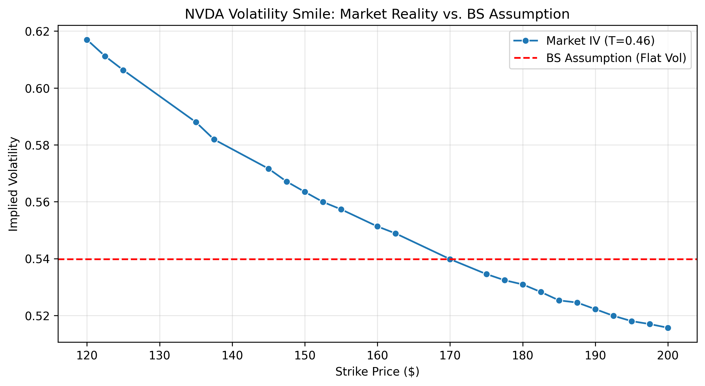
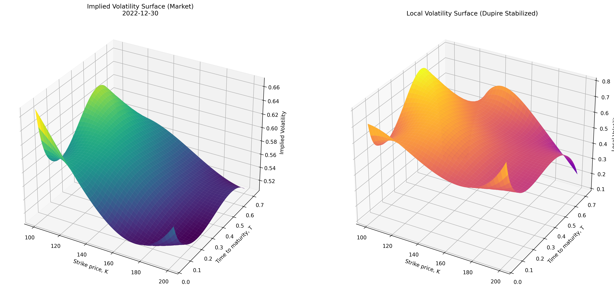

# NVDA Local Volatility Modeling: Dupire vs. Black-Scholes

This project implements a **Dupire Local Volatility** framework to price NVDA options, moving beyond the static assumptions of the Black-Scholes model. Using historical option chain data (2020-2022), we calibrate a state-dependent volatility surface to capture the empirical "volatility smirk" and analyze model discrepancies.

The dataset used is [$NVDA Option Chains - Q1 2020 to Q4 2022](https://www.kaggle.com/datasets/kylegraupe/nvda-daily-option-chains-q1-2020-to-q4-2022).

## Project Overview
The standard Black-Scholes model assumes constant volatility ($\sigma$), which fails to account for the market's pricing of tail risk. This project:
1.  Extracts & Cleans multi-year NVDA option chains.
2.  Constructs a smooth Implied Volatility (IV) Surface using bivariate splines.
3.  Derives the Local Volatility Surface using the Dupire Identity.
4.  Prices options via Monte Carlo simulation and compares them against the Black-Scholes benchmark.

## Visual Analysis

#### The Volatility Smile
The 2D Smile plot demonstrates the "Skew" or "Smirk" in NVDA options. Note how implied volatility increases significantly for lower strikes, indicating the market's hedging against downside risk.



#### The Volatility Surface
The 3D surface shows the term structure of volatility. By interpolating across both Strike and Time to Maturity, we create the continuous input required for the Dupire Equation.



## Download the [dataset](https://www.kaggle.com/datasets/kylegraupe/nvda-daily-option-chains-q1-2020-to-q4-2022)
```bash
curl -L -o ../data/nvda-daily-option-chains-q1-2020-to-q4-2022.zip\
  https://www.kaggle.com/api/v1/datasets/download/kylegraupe/nvda-daily-option-chains-q1-2020-to-q4-2022
unzip -o ../data/nvda-daily-option-chains-q1-2020-to-q4-2022.zip\
  -d ../data/
```

## Project Structure
```text
.
├── data/                # Directory for the datset (to download data see the script above)
├── figures/             # Generated visualizations (smile and surface)
├── notebooks/           # Directory with the Jupyter notebook
├── src/                 # Python scripts for pricing
│   ├── data_loader.py   # Data cleaning and preprocessing
│   ├── pricing.py       # BS model and Monte Carlo LV pricing functions
│   ├── vol_surface.py   # Spline fitting and Dupire formula
│   └── visualization.py # Surface and smile plotting functions
└── README.md